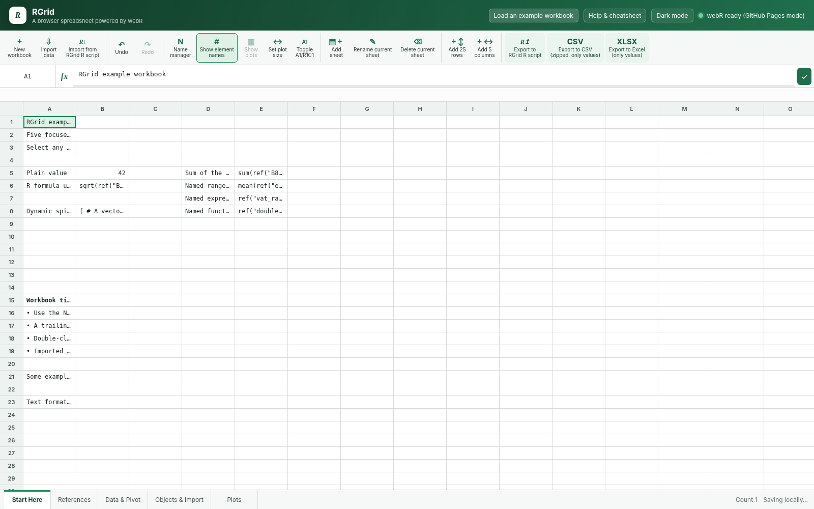

# RGrid

## Accessible at https://alekrutkowski.github.io/RGrid/

RGrid is a static, browser-only reactive spreadsheet with an Excel-like grid and [R](https://en.wikipedia.org/wiki/R_%28programming_language%29) as its formula language. Formulas run locally through [webR](https://docs.r-wasm.org/webr). There is no application server and workbook data is not sent to a calculation backend. The app has been made with GPT-5.5-Thinking.



## Live deployment

The project is ready for GitHub Pages. Push the repository to a GitHub repository whose default branch is `main`, then enable **Settings → Pages → Source: GitHub Actions**. The included `.github/workflows/pages.yml` publishes the repository root after each push to `main`.

GitHub Pages does not provide the cross-origin isolation headers used by webR's service-worker channel. RGrid detects that condition and selects webR's PostMessage channel automatically. Local servers that provide COOP and COEP headers continue to use the faster default channel.

## Run locally

Do not open `index.html` from a `file://` URL. Serve the directory over HTTP.

### Windows 11, Ubuntu, or WSL2 with Python

```bash
python serve.py
```

Open `http://127.0.0.1:8080`.

### With system R and httpuv

```r
install.packages("httpuv") # once
```

```bash
Rscript serve.R
```

The supplied local servers add cross-origin isolation headers suitable for webR.

## Starting state and example workbook

A fresh browser profile with no RGrid autosave starts with one empty worksheet. The **New workbook** command also creates a blank workbook.

Use the title-bar **Load an example workbook** button to replace the current workbook with a five-sheet guided workbook:

- **Start Here** – values, formulas, dynamic spills, named ranges, named expressions, and named functions.
- **References** – A1 and R1C1 cells, ranges, quoted cross-sheet references, spill references, preserved objects, blank cells, literal formula-looking text, and safe descriptions of error corner cases.
- **Data & Pivot** – a long `data.table`, `data.table::dcast()` pivot-table patterns, and a narrowly filtered `eurodata::importData()` request.
- **Objects & Import** – nested R lists, vectors, matrices, function objects, `rio::import()`, data-file import semantics, zero-length values, `NULL`, and missing values.
- **Plots** – base R graphics, multiple base plots from one formula, a returned ggplot2 object, a returned lattice object, and a plot driven by cross-sheet data.

The formulas contain comments intended to be read in the formula editor. Some examples install CRAN packages or fetch a small public dataset when they are first calculated.

## Data import

Use **Import data** to add external values as new worksheets.

- CSV files create one new worksheet per file.
- TSV files create one new worksheet per file.
- Excel files create one new RGrid worksheet for every worksheet in the workbook.
- Excel formulas are not imported. RGrid imports the cached or calculated cell values exposed by the file.
- Text is stored as literal text, including text beginning with `=` or text that resembles R code.
- Existing worksheets are not overwritten. Imported sheet names are made unique automatically.

CSV and TSV parsing is built into RGrid. Excel import loads SheetJS on demand.

## Formula model

A cell formula is an R expression. A leading `=` is optional for expressions that are unambiguously R, but is useful for spreadsheet-style editing and bare names.

```r
=1 + 2
=mean(ref("A1:A10"), na.rm = TRUE)
=ref("R1C5:R7C8")
=ref("Sheet2!B3")
=ref("sales")
=matrix(1:12, nrow = 4, byrow = TRUE)
={library(magrittr); rnorm(100) %>% matrix(ncol = 2)}
```

Braces may contain multiple expressions. The value of the final expression becomes the cell result.

Plain text is detected positively rather than by punctuation. Labels containing commas, colons, hyphens, parentheses, `+`, or `!` remain text unless they clearly form an R expression. A leading `=` is recommended whenever an expression could be ambiguous.

Text-cell display supports minimal inline Markdown: `**bold**` and `__bold__` render in bold; `*italic*` and `_italic_` render in italics. The stored cell input remains unchanged. Hovering over a pure text cell shows its complete content in a Markdown-aware pop-up, which is useful when the column is too narrow.


### Package use across cells

RGrid detects package dependencies in both `library(package)` or `require(package)` calls and qualified calls such as `package::function()`. Missing browser packages are installed before evaluation.

All worksheets share one R session. After a `library(data.table)` cell evaluates successfully, the package is attached to the shared search path and unqualified functions are available from cells in every sheet. On a fresh recalculation, calculation order still matters for independent cells, and visual sheet position alone does not create a dependency. Use an explicit `ref()` dependency or, preferably, `data.table::dcast()`-style qualified calls when a formula should not depend on another cell running first. Qualified `::` calls use the package namespace without attaching it or adding names to the shared search path.

### References and dynamic arrays

`ref()` accepts case-insensitive A1, R1C1, named, cross-sheet, rectangular, and dynamic spill references. A Name manager entry may also contain an R expression, and `ref()` returns that expression's value:

```r
ref("A1")
ref("A1:G8")
ref("R1C5:R7C8")
ref("D3#")
ref("my_range")
```

Vectors spill vertically. Matrices, arrays, and data frames spill across rows and columns. Selecting the exact footprint of an existing spill while editing inserts its anchor form, such as `ref("D3#")`. A blocked spill produces `#SPILL!` with a detailed explanation.

The sheet expands when a result needs more room. Browser-safety ceilings are 10,000 rows, 1,000 columns, and 500,000 rendered cells.

### A1 and R1C1 display

Use **Toggle A1/R1C1** to change column headers and newly inserted references:

- A1 mode displays columns as `A`, `B`, `C`, and inserts references such as `ref("B4")`.
- R1C1 mode displays columns as `1`, `2`, `3`, and inserts references such as `ref("R4C2")`.

The selected style is saved with the workbook and included in RGrid R-script backups.

## Preserved R objects

RGrid retains each calculated cell's original R object in the webR session. Single-cell and spill references therefore preserve names, dimensions, classes, lists, attributes, and functions.

```r
# M16 contains data.frame(AAA = 1:10, Bbb = letters[1:10])
=ref("M16#")[, "AAA"]

# J6 contains list(a = 1, nested = list(b = 2))
=ref("J6")$nested$b
=ref("J6")[[2]][[1]]

# J4 contains function(x) x + 3
=ref("J4")(7)
```

Both `function(x) x + 3` and R's shorthand `\(x) x + 3` are accepted as cell values and name-manager values.

Double-click a non-data-frame list cell to inspect it in a collapsible tree. Press `Esc` to close the tree.

### Element names

**Show element names** controls vector names, row names, column names, and dimension names. It is on for a new workbook.

Autosave and R-script restoration retain this setting.

## R packages

The evaluator detects packages used through `library()`, `require()`, `pkg::fun`, and `pkg:::fun`. Missing webR-compatible packages are installed in the browser before evaluation. The example workbook deliberately exercises `data.table`, `eurodata`, `rio`, `ggplot2`, and `lattice`. Installation or compatibility failures produce `#PKG!` and show the underlying R condition beneath the formula bar and in the cell tooltip.

## Formula editor

The formula field uses a locally bundled CodeMirror R editor, so syntax, selection, cursor, scrolling, and bracket matching share one rendering surface.

- Press `Alt+Enter` to insert a line break without committing.
- Select code and type `'`, `"`, `(`, `[`, or `{` to wrap the selection in the matching pair.
- Drag anywhere along the full bottom edge to change the editor height.
- Matching parentheses, brackets, and braces are highlighted.
- While editing, click or drag over cells to insert `ref()` at the cursor.
- Put the cursor inside an existing literal `ref()` to highlight its target cells.
- Press `F1` with the cursor on a function name to open its documentation. For `ref()`, RGrid shows a styled help box inside the app describing cell, range, spill, R1C1, and Name manager references; other functions open their documentation in a new browser tab.
- Click the **fx** icon to open the general R function index.

For `ref()`, F1 opens RGrid's own in-page help box. For core R packages, F1 opens the corresponding R manual page. For an explicitly namespaced or detected CRAN package function, F1 opens that package's CRAN reference manual at the function anchor.

Numbers are displayed with decimal dots and without locale-specific grouping separators.

## Mouse and keyboard

| Input | Action |
|---|---|
| Drag | Select a rectangular range |
| Shift+Arrow | Extend the selection one cell |
| Ctrl+Arrow | Jump to a data-region boundary |
| Ctrl+Shift+Arrow | Extend to a data-region boundary |
| Enter | Commit and move down |
| Alt+Enter | Insert a formula line break |
| F1 | Open help for the function at the formula cursor |
| F2 | Edit the active cell |
| Delete | Clear the selected cells |
| Ctrl+C / Ctrl+X / Ctrl+V | Copy, cut, and paste formulas and values |
| Ctrl+Z / Ctrl+Y | Undo and redo |
| Esc | Cancel editing or close an object viewer |

The title-bar **Help & cheatsheet** link opens `help.html` in a new page.

Double-click a list cell to open its tree viewer. Use **Expand all** to reveal the complete nested tree in one step; the same button changes to **Collapse all** when every branch is open.

## Plots

Base R graphics are captured from formulas and displayed in the resizable **Plots** pane. Returned ggplot2 and lattice objects are printed automatically.

```r
={plot(ref("A1:A100"), ref("B1:B100")); NULL}
={hist(rnorm(1000)); plot(density(rnorm(1000))); NULL}
=ggplot2::ggplot(mtcars, ggplot2::aes(wt, mpg)) + ggplot2::geom_point()
```

- Double-click a plot cell to reveal its plot.
- ggplot2 cells display `Plot` with `ggplot2` in superscript; lattice cells display `Plot` with `lattice` in superscript. Both use the small plot marker in the top-left corner.
- The pane scrolls vertically and preserves the full aspect ratio of landscape, square, and portrait plots.
- Drag the pane's left divider to change its width.
- Use **Set plot size** for presets or custom bitmap dimensions from 320 × 240 to 4096 × 4096 pixels.

Plots are regenerated during recalculation and are not embedded in CSV or Excel exports.

## Name manager

The **Name manager** can add, edit, and remove workbook names. A name may refer to a range or contain an R value:

```text
Sheet1!A1:B10
function(x) x + 3
\(x) x + 3
list(rate = 0.05, periods = 12)
```

Names are case-insensitive. Named expressions participate in package detection and formula dependencies.

## Calculation and errors

RGrid extracts literal `ref()` calls, constructs a dependency graph, detects cycles, and evaluates formulas in dependency order. Cell call order is the stable tie-breaker. Recalculation is automatic.

Common error codes:

- `#REF!` – invalid reference
- `#SPILL!` – blocked or oversized dynamic array
- `#CYCLE!` – circular dependency
- `#PKG!` – package installation or availability failure
- `#PARSE!` – R syntax error
- `#R!` – another R evaluation error

A light-gray spinner appears while webR initializes and while calculation or import work is active.

## Persistence, export, and restoration

The workbook, view settings, formula-editor height, plot-pane width, plot resolution, and theme are stored in browser `localStorage`. Undo history keeps up to 100 snapshots for the current page session.

### Executable RGrid R script

**Export to RGrid R script** creates a file that is both a lossless workbook backup and an executable R calculation script.

- Cells are registered in workbook call order.
- Dependencies determine calculation order.
- Package installation uses `webr::install()` only when `R.version$arch` is exactly `"wasm32"`; all other architectures use `install.packages()`. The exported file can therefore be sourced by a standard R interpreter without a `webr` package dependency.
- `rgrid$objects` contains preserved calculated R objects.
- `rgrid$values` contains typed calculated cell contents.
- `rgrid$display` contains console-friendly sheet matrices.
- `rgrid$errors` contains detailed errors.
- `rgrid$workbook` contains formulas and metadata.
- A chunked base64 JSON annotation restores the exact RGrid workbook.

```r
source("RGrid-Workbook.R")
```

Use **Import from RGrid R script** to restore the workbook in RGrid.

### Calculated-value exports

- **Export to CSV (zipped, only values)** creates one calculated CSV file per worksheet.
- **Export to Excel (only values)** creates a calculated-value-only Excel workbook.

Formulas, plots, and RGrid metadata are intentionally omitted from these formats.

## Static dependencies

- webR 0.6.0 is loaded from the official webR CDN.
- CodeMirror 5.58.3 is bundled locally for the formula editor.
- SheetJS Community Edition 0.20.3 is loaded on demand for Excel import and export.

For an offline deployment, self-host the matching webR release assets and SheetJS module, then update the constants near the top of `app.js`.

## Scope

RGrid supports blank startup, an optional five-sheet example workbook, multiple sheets, external value import, names, A1/R1C1 display, object-preserving R references, dynamic arrays, automatic grid growth, package loading, plots, formula-aware clipboard operations, local autosave, themes, undo and redo, executable R export, and calculated CSV and Excel exports.

It does not reproduce Excel formatting, merged cells, macros, Excel chart objects, relative-reference rewriting during formula copy, or collaboration.
